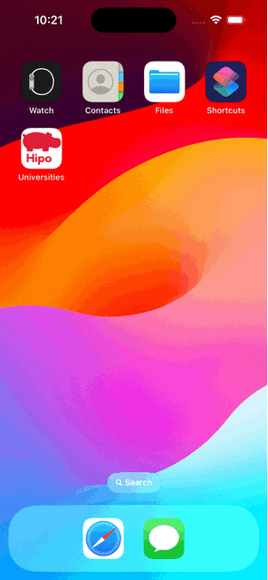
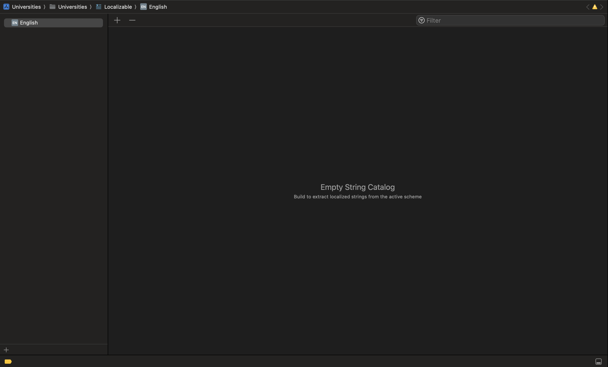

# Universities App

## Package Declarations

### ListingScreen (Module A)
ListingScreen is a package that contains the Listing Screen and has dependencies on the DAL package.

### DetailsScreen (Module B)
DetailsScreen is a package that contains the Details Screen and has dependencies on the Common package.

### Common
The Common package contains shared files and has dependencies on RealmSwift.

### DAL (Data Access Layer)
The DAL package contains data access layer files and has dependencies on the Common package and RealmSwift.

## Installation

1. **Clone the repository**:
    ```sh
    git clone https://github.com/Ahmed-Elsman/universities.git
    cd universities
    ```

2. **Install dependencies**:
    - Ensure you have two main packages ListingScreen, DetailsScreen.
    - If you face any problem just right-click on Package Dependencies and click on Resolve Package Versions

3. **Open the project**:
    - Open `Universities.xcodeproj` in Xcode.

4. **Build and Run**:
    - Select the target device and run the application.

## Demo


## Usage

### Listing Screen (Module A)
- The user lands on the Listing screen which fetches data from the API and caches it in the local database. If the API call fails, data is fetched from the local database if available, otherwise, an error alert is displayed.

### Details Screen (Module B)
- The user can tap on an item in the listing screen to navigate to the details screen. The details screen shows detailed information about the selected university.

### Refresh Functionality
- A refresh button is provided to refresh the listing screen. The details screen can be back to the listing screen, which triggers a refresh and refetches data from the API.

## API and Domain-Driven Design (DDD)

- The app fetches data from the following API:
    ```
    http://universities.hipolabs.com/search?country=United%20Arab%20Emirates
    ```

### Domain-Driven Design (DDD)

We have implemented Domain-Driven Design (DDD) principles to structure our application effectively. The key aspects of our DDD implementation are as follows:

1. **Domain Layer**: This layer contains the business logic and domain models, such as the `University` entity. It encapsulates the core functionality of the application.

2. **Application Layer**: This layer coordinates the application's behavior by interacting with the domain layer. It includes use cases such as fetching universities and handles the flow of data between the user interface and the domain layer.

3. **Infrastructure Layer**: This layer handles the technical implementation details, such as network requests and database operations. It includes the `UniversityRepository` implementation and manages the interaction with Realm for local data persistence.
    
## Localization

The project is open for localization with adding multiple languages using String Catalogs, we are now supporting:

- English

we can add more languages from here just click on the plus icon (+) and select the language, also this catalog should be refactored by adding localization for each package related to it's usage.



## Acknowledgments

- This project uses [Realm](https://realm.io/) for the local database.
- The network requests are handled using [URLSession](https://developer.apple.com/documentation/foundation/urlsession).

## Future Enhancements

- **Snapshot Testing**: Add snapshot testing to verify the UI across different states.
- **Unit Tests**: Cover critical parts of the application with unit tests, especially network request handling and data retrieval.
- **Navigation Refactoring**: Refactor the navigation logic for better reusability across the app.
  
## Info

Name: Ahmed Elsman

Email: ahmedelsman0@gmail.com

Thanks Hope to hear from you soon.


